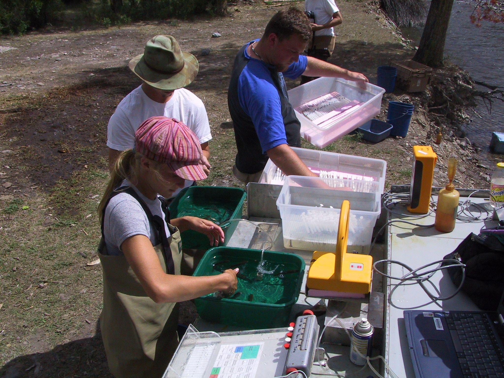
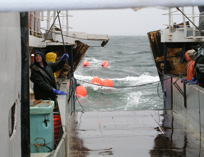
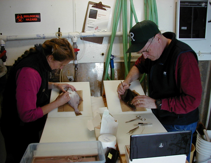
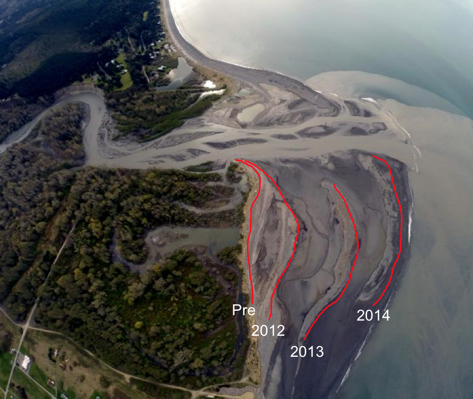
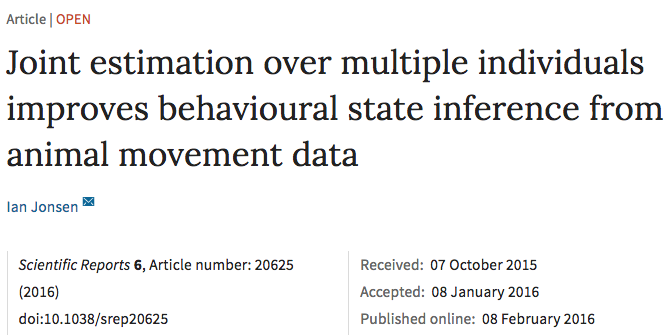

---
output:
  xaringan::moon_reader:
    chakra: libs/remark-latest.min.js
    css: "my-theme.css"
    lib_dir: libs
    nature:
      highlightStyle: github
      highlightLines: true
---

```{r setup, include=FALSE, message=FALSE}
options(htmltools.dir.version = FALSE, servr.daemon = TRUE)
library(huxtable)
```

class: center, middle
# RESEARCH IN THE FISH ECOLOGY DIVISION
## Mark Scheuerell
_Northwest Fisheries Science Center<br>National Oceanic and Atmospheric Administration<br>Seattle, WA_

.futnote.blue-text[`r icon::fa("twitter")` @mark_scheuerell]

.citation.blue-text[LMRCSC]

---

class: frimg, center 
background-image: url(figs/mit_fire_hose.jpg)
background-size: cover

.white-text[
# I hope you're thirsty!
]

---

# Our division comprises 4 programs

.large.blue-text[
## 1. Ecosystem Analysis 
]

.pull-left-img[
### Empirical field work

### Quantitative ecology

### Legal consultations  
]

.pull-right[]

---

# Our division comprises 4 programs

.large.blue-text[
## 2. Estuarine and Ocean Ecology 
]

.pull-left-img[
### Food web focused

### Empirical field work

### Quantitative ecology

]

.pull-right[]

---

# Our division comprises 4 programs

.large.blue-text[
## 3. Migrational Behavior 
]

.pull-left-img[
### Empirical field work

### Dam passage

### Salmon, shad, sturgeon & lamprey

]

.pull-right[]

---

# Our division comprises 4 programs

.large.blue-text[
## 4. Watershed
]

.pull-left-img[
### Empirical field work

### Fish-habitat relationships

### Restoration & monitoring

]

.pull-right[]

---

class: center, middle, inverse

# Lots of focus on *hierarchical models*

---

class: frimg, center
background-image: url(figs/horrified.jpg)
background-size: cover

---

# Hi·er·ar·chi·cal

### *adjective*

1. ## Arranged in an order

---

class: center, middle, inverse

# A hierarchical model is simply
# a model within a model

---

# Hierarchical models also masquerade as

.blue-text[
## Nested data models
## Mixed models
## Random-effects models
## State-space models
]

---

class: center, middle, inverse

# A state-space model has 2 parts

---

# Part 1: State model

## Describes the .blue-text[true state of nature] over time or space

```{r state_diag, dpi=300, fig.height=4, fig.width=8, out.height="100%", out.width="100%", fig.align='center', echo=FALSE, warning=FALSE}
par(mai=c(0.8,0.8,0,0), omi=rep(0,4))
## boundaries
ss <- 5
nn <- 7
rr <- ss*3
cc <- ss*nn
## mid-points
xm <- ss/2 + seq(0,cc-ss,ss)
ymt <- rr - ss/2
ymb <- ss/2
## arrow locs
x0t <- seq(ss, by=2*ss, len=3)
x1t <- x0t + ss
## empty plot space
plot(c(0,cc), c(0,rr), type="n", xlab="", ylab="",
     xaxt="n", yaxt="n", bty="n")
## top row: state
symbols(x=xm[c(1,3,5,7)], y=rep(ymt,4), circles=rep(ss/2,4),
        lty="solid",  fg=NA, bg="#488fdf",
        inches=FALSE, add=TRUE, lwd=3)
text("Truth", x=-ss, y=ymt, adj=c(0,0.5), xpd=NA,
     cex=2, col="#488fdf")
arrows(x0=x0t,x1=x1t,y0=ymt, col="#488fdf", lwd=3, length=0.12)
## Time or space
arrows(x0=ss/2, x1=cc-ss/2, y0=-ss/3+ss*2,
       length=0.12, lwd=3, xpd=NA)
text("Time or space", x=cc/2, y=-ss/2+ss*2, xpd=NA, pos=1, cex=2)
```

---

# States of nature might be

.blue-text[
## Animal location
## Species density
## Age structure
## Reproductive status
]

---

class: center, middle, inverse

# Revealing the state of nature
# requires some observations

---

class: center, middle, inverse

# Observing nature can be easy

---

class: frimg, bottom, right
background-image: url(figs/sockeye.jpg)
background-size: cover

# .white-text[How many salmon are there?]

---

class: center, middle, inverse

# Observing nature can also be hard

---

class: frimg, bottom, right
background-image: url(figs/sockeye.jpg)
background-size: cover

# .white-text[How many mayflies are there?]

---

# Part 2: Observation model

## .purple-text[Data] = .blue-text[Truth] &#177; .red-text[Errors]

---

# Part 2: Observation model

## .purple-text[Data] = .blue-text[Truth] &#177; .red-text[Errors]

```{r obs_diag, dpi=300, fig.height=4, fig.width=8, out.height="100%", out.width="100%", fig.align='center', echo=FALSE, warning=FALSE}
par(mai=c(0.8,0.8,0,0), omi=rep(0,4))
## arrow locs
x0t <- seq(ss, by=2*ss, len=3)
x1t <- x0t + ss
y0b <- rr - ss
y1b <- ss
## empty plot space
plot(c(0,cc), c(0,rr), type="n", xlab="", ylab="",
     xaxt="n", yaxt="n", bty="n")
## top row: state
symbols(x=xm[c(1,3,5,7)], y=rep(ymt,4), circles=rep(ss/2,4),
        lty="solid",  fg=NA, bg="#488fdf",
        inches=FALSE, add=TRUE, lwd=3)
text("Truth", x=-ss, y=ymt, adj=c(0,0.5), xpd=NA,
     cex=2, col="#488fdf")
## arrows
arrows(x0=x0t,x1=x1t,y0=ymt, col="#488fdf", lwd=3, length=0.12)
## bottom row: obs
symbols(x=xm[c(1,3,5,7)], y=rep(ss/2,4), circles=rep(ss/2,4),
        lty="solid",  fg=NA, bg="#844870",
        inches=FALSE, add=TRUE, lwd=3)
text("Data", x=-ss, y=ss/2, adj=c(0,0.5), xpd=NA,
     cex=2, col="#844870")
## arrows
arrows(x0=xm[c(1,3,5,7)], y0=y0b, y1=y1b,
       col="#c10101", lwd=3, length=0.12)
## Time or space
arrows(x0=ss/2, x1=cc-ss/2, y0=-ss/3,
       length=0.12, lwd=3, xpd=NA)
text("Time or space", x=cc/2, y=-ss/2, xpd=NA, pos=1, cex=2)
```

---

class: inverse, center, middle

# OK, but why bother?

---

# Advantages of hierarchical models

## 1. Can combine many different .purple-text[data types]

.purple-text[
### Changes in observers or sensors

### Varying survey locations & effort

### Direct & remote sampling  
]

---

# Advantages of hierarchical models

## 2. .gray-text[Missing data] are easily accommodated

```{r obs_NA, dpi=300, fig.height=4, fig.width=8, out.height="100%", out.width="100%", fig.align='center', echo=FALSE, warning=FALSE}
par(mai=c(0.8,0.8,0,0), omi=rep(0,4))
## arrow locs
x0t <- seq(ss, by=2*ss, len=3)
x1t <- x0t + ss
y0b <- rr - ss
y1b <- ss
## empty plot space
plot(c(0,cc), c(0,rr), type="n", xlab="", ylab="",
     xaxt="n", yaxt="n", bty="n")
## top row: state
symbols(x=xm[c(1,3,5,7)], y=rep(ymt,4), circles=rep(ss/2,4),
        lty="solid",  fg=NA, bg="#488fdf",
        inches=FALSE, add=TRUE, lwd=3)
text("Truth", x=-ss, y=ymt, adj=c(0,0.5), xpd=NA,
     cex=2, col="#488fdf")
## arrows
arrows(x0=x0t,x1=x1t,y0=ymt, col="#488fdf", lwd=3, length=0.12)
## bottom row: obs
symbols(x=xm[c(1,3,7)], y=rep(ss/2,3), circles=rep(ss/2,3),
        lty="solid",  fg=NA, bg="#844870",
        inches=FALSE, add=TRUE, lwd=3)
text("Data", x=-ss, y=ss/2, adj=c(0,0.5), xpd=NA,
     cex=2, col="#844870")
## NA's
symbols(x=xm[5], y=ss/2, circles=ss/2,
        lty="solid",  fg=NA, bg="#656565",
        inches=FALSE, add=TRUE, lwd=3)
text("NA", x=xm[5], y=ss/2, cex=1.8, col="#ffffff")
## arrows
arrows(x0=xm[c(1,3,7)], y0=y0b, y1=y1b,
       col="#c10101", lwd=3, length=0.12)
## Time or space
arrows(x0=ss/2, x1=cc-ss/2, y0=-ss/3,
       length=0.12, lwd=3, xpd=NA)
text("Time or space", x=cc/2, y=-ss/2, xpd=NA, pos=1, cex=2)
```

---

class: frimg

# Advantages of hierarchical models

## 3. Improved accuracy & precision

.img-left-land[]

---

# Advantages of hierarchical models

## 4. Rather flexible

.center.blue-text[
### This simple model can be used for 5+ unique applications!
]

$$\LARGE \mathbf{x}_t = \mathbf{B} \mathbf{x}_{t-1} + \mathbf{w}_t \\
  \LARGE \mathbf{y}_t = \mathbf{Z} \mathbf{x}_t + \mathbf{v}_t$$

---

##  Slide deck

### https://github.com/mdscheuerell/lmrcsc

## Image sources

.left.blue-text[
### Drinking fountain: *Massachusetts Inst Tech*
### Janet Leigh: *Paramount Studios*
### Snake oil: *The Register*
]

.futnote.blue-text[`r icon::fa("twitter")` @mark_scheuerell]
